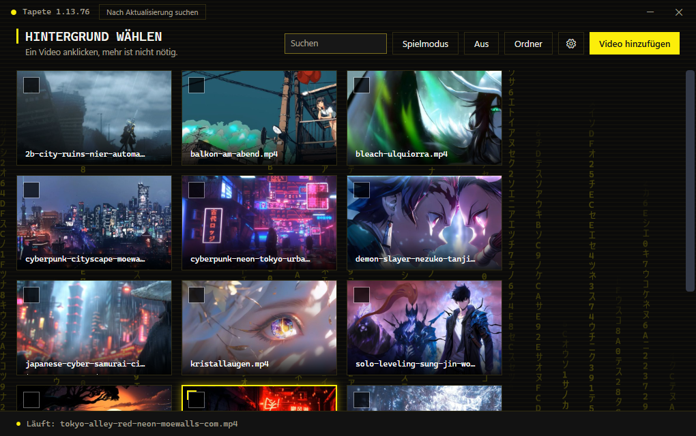
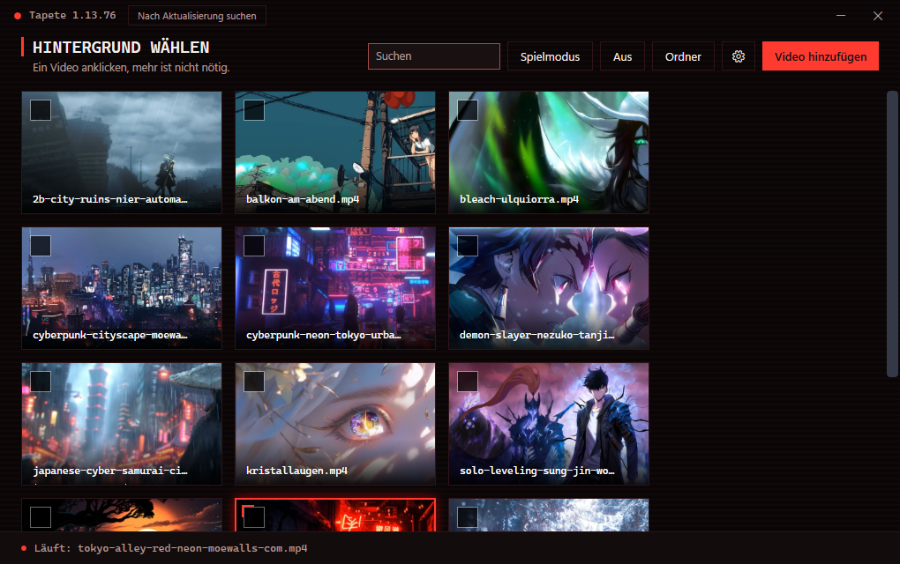
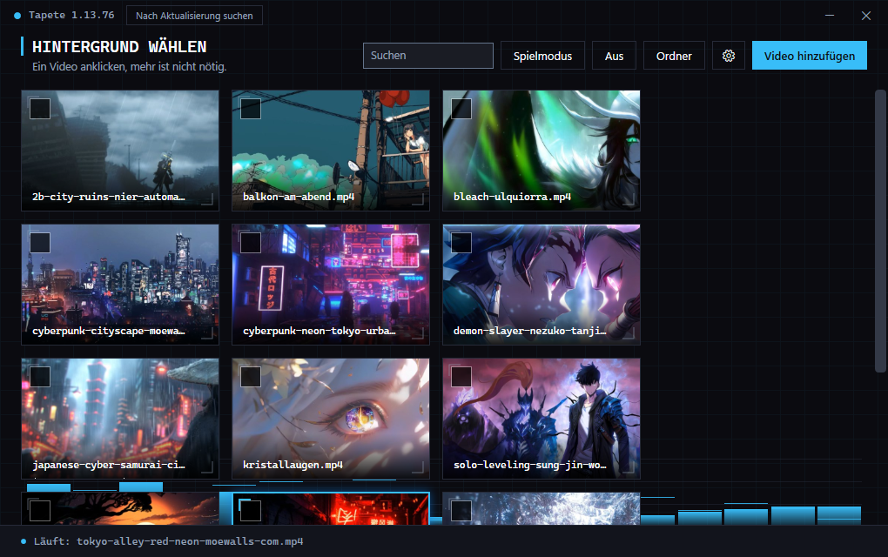
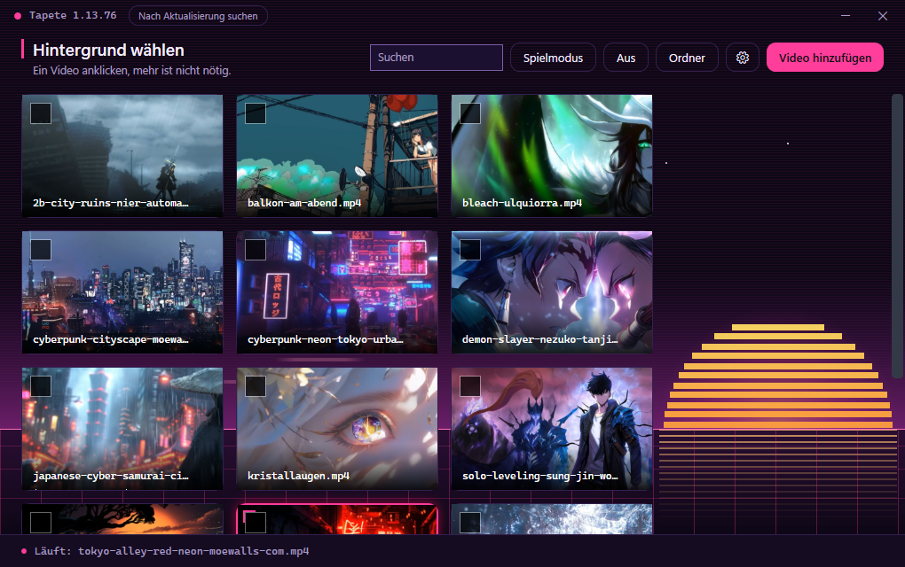

# Tapete

Dein Desktop zeigt ein Video statt eines Standbilds. Die Symbole liegen weiter darüber und
lassen sich ganz normal anklicken.

Angefangen hat das damit, dass Windows 11 mir mit Build 26200 die Ebene zugemacht hat, in
die Lively und ähnliche Programme ihr Video hängen. Mein Desktop war von einem Tag auf den
anderen schwarz. Als ich das reparieren wollte, verschwanden die Symbole. Irgendwann habe
ich aufgehört zu suchen und mir selbst einen Weg gebaut: Tapete hängt das Video eine Ebene
tiefer ein, direkt unter die Symbole.

Ich bastele das für mich. Es läuft auf meinem Rechner und auf dem eines Bekannten, mehr
Erfahrung habe ich damit nicht. Keine Gewähr.

## Loslegen

Hol dir das Setup aus den [Releases](../../releases/latest), rund 95 MB, und starte es. Es
installiert sich in dein Benutzerprofil und fragt dich nicht nach Administratorrechten.

Dann zieh ein Video ins Fenster. Es landet in `Videos\Tapeten`, wo Tapete es sucht. Klick
die Kachel an, und schon läuft es. Videos lege ich keine bei. Warum nicht, steht unter
[Lizenzen](#lizenzen).

Wenn du das Fenster schließt, ist das Programm noch da. Es wartet neben der Uhr, und ein
Doppelklick holt es zurück. Willst du ein Video wieder loswerden, klick mit rechts auf die
Kachel. Es wandert in den Papierkorb, nicht ins Nichts.

## Was du damit machen kannst

| | |
|---|---|
| Karussell | Setz einen Haken auf jede Kachel, die mitlaufen soll, und stell ein, wie lange ein Video stehen bleibt. Gemischt heißt bei mir wirklich gemischt: Jedes kommt einmal dran, bevor sich etwas wiederholt. Mit `Strg+Alt+W` springst du sofort weiter. |
| Zeitplan | Trag eine Uhrzeit ein und ein Video dazu. Morgens läuft dann etwas anderes als abends, auf die Minute genau. |
| Mehrere Bildschirme | Jeder Schirm bekommt sein eigenes Video, oder überall läuft dasselbe. |
| Virtuelle Desktops | Jeder Desktop bekommt sein eigenes Video. Windows selbst kann das nur mit Standbildern. |
| Spielmodus | `Strg+Alt+G` wirft den Abspieler raus, samt seinen 200 MB. Meistens brauchst du das nicht, weil Tapete selbst merkt, wenn etwas im Vollbild startet. |
| Bildschirmschoner | Wenn dein Rechner eine Weile ruht, läuft dasselbe Video im Vollbild weiter. |
| Profile | Leg einen Zustand unter eigenem Namen ab und hol ihn später zurück. |
| Bild und Ton | Helligkeit, Farben, Kontrast, Mitteltöne, Tempo, Lautstärke. Und HDR, falls dein Schirm das kann. |

## Vier Erscheinungsbilder

Jedes hat seinen eigenen Hintergrundeffekt. Die Farben habe ich gegen die
WCAG-Kontrastregeln gerechnet.

| | |
|:---:|:---:|
|  |  |
| Alarm, mit Blitzen | HUD, mit Spektrum |
|  |  |
| Retro-Neon, mit Sonnenaufgang | Cyberpunk, mit Zeichenregen |

## Was es kostet

Ich habe das auf meiner Radeon RX 7800 XT gemessen, über die Windows-Leistungsindikatoren:

| Video | Zeichnen | Dekodieren |
|---|---|---|
| 3440×1440, 60 fps, 30 Mbit | 3,9 % | 27,6 % |
| 1920×1080, 30 fps, 4 Mbit | 0,6 % | 6,3 % |
| 1920×1080, 24 fps, 7 Mbit | 0,5 % | 5,0 % |

Die Last steckt im Dekodieren, und die hängt an deinem Video, nicht an meinem Programm.
Sobald etwas den Desktop verdeckt, fällt beides auf null. Dazu kommen rund 90 MB
Arbeitsspeicher für Tapete und 200 MB für den Abspieler.

Ein 4K-Video auf einem 1080p-Schirm kostet dich den vollen 4K-Preis, obwohl du nichts davon
siehst. Es beim Abspielen zu verkleinern bringt nichts, dekodiert wird trotzdem alles.
Tapete rechnet solche Videos deshalb einmal herunter, im Hintergrund, während das Original
weiterläuft. Aus 28 Prozent Dekodierlast werden so 9. Die kleinen Fassungen liegen unter
`%APPDATA%\Tapete\klein`; den Ordner darfst du jederzeit löschen, was gebraucht wird
entsteht neu.

## Formate

Tapete kennt 75 Endungen, darunter MP4, MKV, MOV, AVI, WMV, WebM, FLV, M2TS, MPEG, VOB und
OGV. Die Liste stammt aus mpvs eigenem Installationsskript. Deine Grafikkarte übernimmt das
Dekodieren bei H.264, HEVC, MPEG-2, VC-1, VP9, WMV3 und AV1.

## Es hält sich selbst aktuell

Beim Start sieht Tapete bei GitHub nach und spielt eine neue Fassung ohne Rückfrage ein. Der
Installer läuft ohne Assistent durch, das Programm startet sich neu, und du merkst davon nur
einen kurzen Aussetzer im Bild. Tapete lädt ausschließlich von `github.com`, über HTTPS.

Wenn du lieber selbst nachschaust: In der Titelzeile steht die laufende Fassung, und daneben
sitzt ein Knopf dafür.

## Wie es funktioniert

Falls du so etwas selbst bauen willst, hier der Weg.

Ab Build 26200 nimmt Windows 11 in `WorkerW` kein fremdes Fenster mehr auf. Offen ist aber
`Progman`, das Desktop-Fenster selbst. Dort hänge ich das Abspielfenster als Kind ein und
schiebe es in der Z-Reihenfolge direkt unter die Symbolebene.

Abspielen lasse ich [mpv](https://mpv.io) und nicht WPF. Ein WPF-Fenster sitzt zwar an der
richtigen Stelle im Fensterbaum, wird unter `Progman` aber schlicht nicht gezeichnet. Ich
habe nachgemessen: In zwei Sekunden veränderten sich 0 von 10000 Bildpunkten. Mit mpv an
derselben Stelle waren es 9123. WPF zeichnet über DirectComposition, und die setzt der
Fenstermanager innerhalb von `Progman` nicht zusammen.

Auf Windows 10 und auf Windows 11 bis 24H2 nimmt Tapete von selbst den alten Weg über
`WorkerW`. Nachgeprüft habe ich das nie, mir fehlt so ein Rechner.

## Wenn etwas nicht läuft

Bei jedem Start schreibt Tapete mit, wie weit es gekommen ist:

    %APPDATA%\Tapete\protokoll.txt

Welche Zeile fehlt, verrät dir, wo es hakt.

Eine Stolperstelle hat mich Stunden gekostet. Startest du Tapete aus einem Programm heraus,
das in einem MSIX-Container läuft, dann landen Einstellungen und Protokoll in dessen
Umleitung statt in deinem echten Profil. Der Autostart findet sie später nicht wieder.
Starte es also direkt aus dem Explorer oder dem Startmenü.

## Selbst bauen

Du brauchst das .NET-10-SDK, und für die Setups zusätzlich [Inno Setup
6](https://jrsoftware.org/isinfo.php).

    dotnet publish Tapete.csproj -c Release -o fertig
    ISCC.exe setup\Tapete.iss

`mpv.exe` und `d3dcompiler_43.dll` gehören in den Ordner `fertig`. Ich lege sie nicht mit
ins Repository.

## Lizenzen

Meinen Code kannst du unter der [MIT-Lizenz](LICENSE) verwenden.

`mpv.exe` gehört nicht dazu. Ich nehme den Windows-Bau von
[shinchiro](https://github.com/shinchiro/mpv-winbuild-cmake), den ersten Link, auf den
[mpv.io](https://mpv.io/installation/) für Windows verweist. mpv steht unter GPL
beziehungsweise LGPL, und Quellcode wie Lizenztexte findest du bei
[mpv-player/mpv](https://github.com/mpv-player/mpv). mpv.io selbst gibt keine
Windows-Dateien heraus und nennt alle Binärpakete ausdrücklich inoffizielle Bauten Dritter.

Die Videos, mit denen ich entwickelt habe, gehören mir nicht. Sie stammen aus dem Netz, auf
einem steht sogar ein Wasserzeichen. Deshalb liegt keines davon hier und keines im Setup.
Wenn du welche zum Ausprobieren suchst: [Pexels](https://www.pexels.com/videos/),
[Pixabay](https://pixabay.com/videos/) und [Coverr](https://coverr.co/) erlauben die
Weitergabe ausdrücklich.
